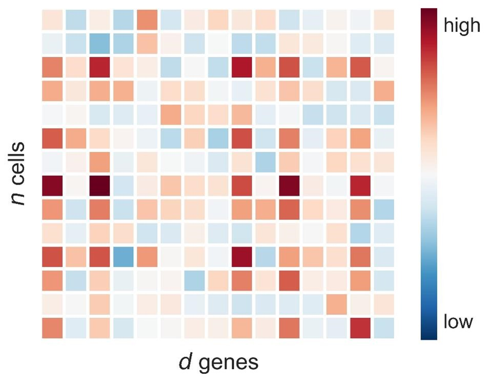
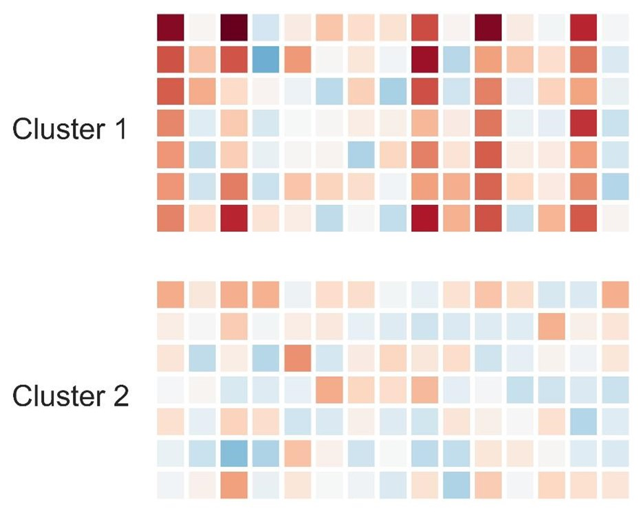
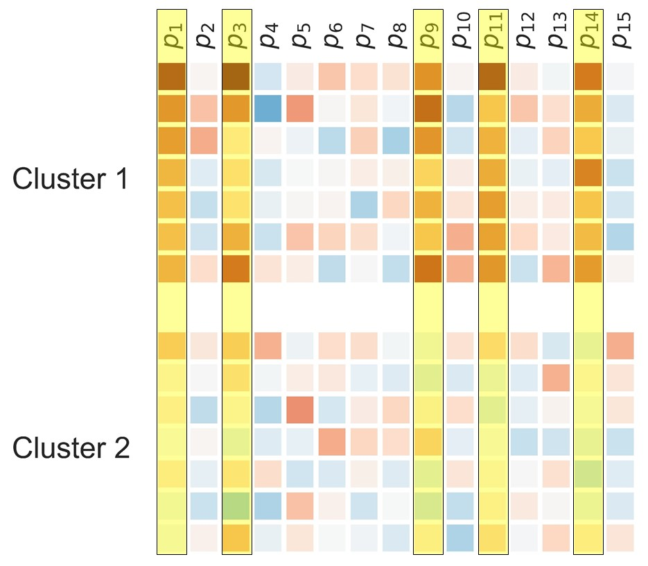

# scPCI
single-cell Post-Clustering Inference

## Abstract
Single-cell RNA-sequencing (scRNA-seq) is useful for uncovering hidden cellular heterogeneity in a cell population. 
In scRNA-seq data analysis, clustering is commonly used for identifying cell groups as clusters, and then cluster-specific genes which are differentially expressed (DE) in one or more clusters are detected. 
Unfortunately, due to the lack of valid statistical method for computing $p$-values, the latter cluster-specific DE gene detection has been subjectively done by ``eyes'', i.e., based on visualization-tools such as $t$SNE.
The intrincic difficulty of the statistical analysis of cluster-specific DE genes is in \emph{double-dipping} effect; the scRNA-seq data is first used for identifying clusters, and then the same data is used again for detecting cluster-specific DE genes.

In this method, we develop a new statistical method called \emph{single-cell post-clustering inference (scPCI)} that can properly correct the clustering bias by using recent statistical analysis framework called \emph{selective inference}.
We demonstrate the validity and the usefulness of the scPCI method in controlled simulations studies and re-analyses of published scRNA-seq datasets.
The scPCI method enables the researchers to obtain valid $p$-values of cluster-specific DE genes, which makes scRNA-seq more quantitative, reliable and reproducible. 

## Environmental Requirement

## Usage

## Data format

## Lisence
GNU General Public License
